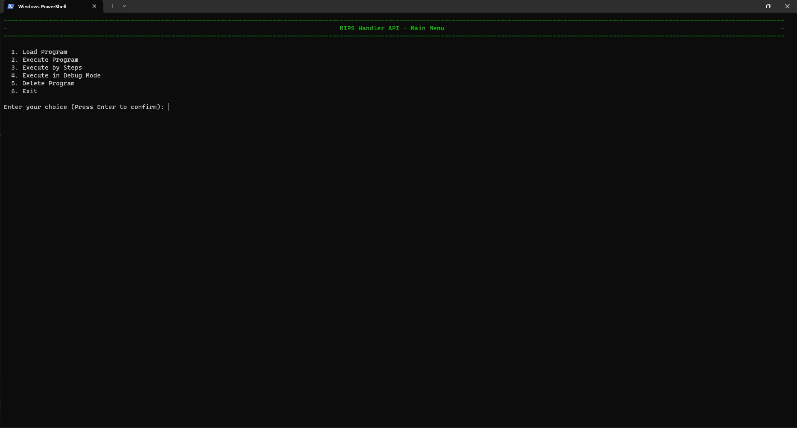

# Diseño e Implementación de un Procesador MIPS Segmentado en una FPGA

### Autores: 
- **Bottini, Franco Nicolas** 
- **Robledo, Valentin** 

## Tabla de Contenidos

- [¿ Cómo usar este repositorio ?](#¿-cómo-usar-este-repositorio-)
   - [1. Clonar el repositorio](#1-clonar-el-repositorio)
   - [2. Crear un nuevo proyecto en Vivado](#2-crear-un-nuevo-proyecto-en-vivado)
   - [3. Agregar los archivos del proyecto](#3-agregar-los-archivos-del-proyecto)
   - [4. Generar el bitstream](#4-generar-el-bitstream)
   - [5. Programar la FPGA](#5-programar-la-fpga)
   - [6. Ejectuar la aplicación de usuario](#6-ejectuar-la-aplicación-de-usuario)
- [¿ Cómo usar la aplicación de usuario ?](#¿-cómo-usar-la-aplicación-de-usuario-)
   - [1. Cargar un programa en la memoria de instrucciones](#1-cargar-un-programa-en-la-memoria-de-instrucciones)
   - [2. Ejecutar el programa cargado en la memoria de instrucciones](#2-ejecutar-el-programa-cargado-en-la-memoria-de-instrucciones)
   - [3. Ejecutar el programa cargado en la memoria de instrucciones paso a paso](#3-ejecutar-el-programa-cargado-en-la-memoria-de-instrucciones-paso-a-paso)
   - [4. Ejecutar el programa cargado en la memoria de instrucciones en modo debug](#4-ejecutar-el-programa-cargado-en-la-memoria-de-instrucciones-en-modo-debug)
   - [5. Eliminar el programa cargado en la memoria de instrucciones](#5-eliminar-el-programa-cargado-en-la-memoria-de-instrucciones)
   - [6. Salir de la aplicación](#6-salir-de-la-aplicación)
- [1. Resumen](#1-resumen)
- [2. Especificaciones del Procesador](#2-especificaciones-del-procesador)
- [3. Desarrollo](#3-desarrollo)
    - [3.1. Arquitectura del procesador](#31-arquitectura-del-procesador)
    - [3.2. Etapas del Pipeline](#32-etapas-del-pipeline)
        - [3.2.1. Etapa `IF`](#321-etapa-if)
        - [3.2.2. Etapa `ID`](#322-etapa-id)
        - [3.2.3. Etapa `EX`](#323-etapa-ex)
        - [3.2.4. Etapa `MEM`](#324-etapa-mem)
        - [3.2.5. Etapa `WB`](#325-etapa-wb)
    - [3.3. Control y Detención de Riesgos](#33-control-y-detención-de-riesgos)
        - [3.3.1. Unidad de Control Principal](#331-unidad-de-control-principal)
            - [3.3.1.1. Tabla de Control](#3311-tabla-de-control-principal)
        - [3.3.2. Unidad de Control Alu](#332-unidad-de-control-alu)
            - [3.3.2.1. Tabla de Control](#3321-tabla-de-control-alu)
        - [3.3.3. Unidad de Cortocircuito](#333-unidad-de-cortocircuito)
            - [3.3.3.1. Tabla de Control](#3331-tabla-de-control-cortocircuito)
        - [3.3.4. Unidad de Detención de Riesgos](#334-unidad-de-detención-de-riesgos)
            - [3.3.4.1 Tabla de Control](#3341-tabla-de-control-detención-de-riesgos)
    - [3.4. Operación del Procesador](#34-operación-del-procesador)
        - [3.4.1. UART](#341-uart)
        - [3.4.2. Debugger](#342-debugger)
- [4. Simulaciones](#4-simulaciones)
  	- [4.1. Etapa `IF`](#41-tests-etapa-if)
		- [4.1.1. Test Bench para el módulo `PC`](#411-test-bench-para-el-módulo-pc)
		- [4.1.2. Test Bench para el módulo `Instruction Memory`](#412-test-bench-para-el-módulo-instruction-memory)
		- [4.1.3. Test Brench de integración](#413-test-bench-de-integración)
  	- [4.2. Etapa `ID`](#42-tests-etapa-id)
		- [4.2.1. Test Bench para el módulo `Register Bank`](#421-test-bench-para-el-módulo-register-bank)
		- [4.2.2. Test Bench para el módulo `Main Control`](#422-test-bench-para-el-módulo-main-control)
		- [4.2.3. Test Brench de integración](#423-test-bench-de-integración)
  	- [4.3. Etapa `EX`](#43-tests-etapa-ex)
		- [4.3.1. Test Bench para el módulo `ALU`](#431-test-bench-para-el-módulo-alu)
		- [4.3.2. Test Bench para el módulo `ALU Control`](#432-test-bench-para-el-módulo-alu-control)
		- [4.3.3. Test Brench de integración](#433-test-bench-de-integración)
  	- [4.4. Etapa `MEM`](#44-tests-etapa-mem)
		- [4.4.1. Test Bench para el módulo `Data Memory`](#441-test-bench-para-el-módulo-data-memory)
		- [4.4.2. Test Brench de integración](#442-test-bench-de-integración)
  	- [4.5. Etapa `WB`](#45-tests-etapa-wb)
		- [4.5.1. Test Brench de integración](#451-test-bench-de-integración)
	- [4.6. Test `Hazards Units`](#46-test-hazards-units)
		- [4.6.1. Test Bench para el módulo `Short Circuit`](#461-test-bench-para-el-módulo-short-circuit)
		- [4.6.2. Test Bench para el módulo `Risk Detection`](#462-test-bench-para-el-módulo-risk-detection)
	- [4.7. Otros Tests](#47-otros-tests)
	- [4.8. Test de Integración `Mips`](#48-test-de-integración-mips)
		- [4.8.1. Anexo 1: Programas de Prueba](#481-anexo-1-programas-de-prueba) 
			- [4.8.1.1. Programa 1](#4811-programa-1)
			- [4.8.1.2. Programa 2](#4811-programa-2)
			- [4.8.1.3. Programa 3](#4811-programa-3)
		- [4.8.2. Anexo 2: Resultados de Ejecución](#482-anexo-2-resultados-de-ejecución)
			- [4.8.2.1. Ejecución Programa 1](#4821-ejecución-programa-1)
			- [4.8.2.2. Ejecución Programa 2](#4822-ejecución-programa-2)
			- [4.8.2.3. Ejecución Programa 3](#4823-ejecución-programa-3)
	- [4.9. Test de Sistema](#49-test-de-sistema)
- [5. Resultados](#5-resultados)
   - [5.1. Programa 1](#51-Programa-1)
   - [5.2. Programa 2](#52-Programa-2)
   - [5.3. Programa 3](#53-Programa-3)
- [6. Referencias](#6-referencias)
        
## ¿ Cómo usar este repositorio ?

### 1. Clonar el repositorio
El repositorio se puede clonar utilizando el comando `git clone`:

```bash
git clone https://github.com/francobottini99/MIPSFPGA-2023.git
```

### 2. Crear un nuevo proyecto en Vivado
Para crear un nuevo proyecto en Vivado, se debe abrir el software y seleccionar la opción `Create Project` en la ventana de inicio. Luego, se debe ingresar un nombre para el proyecto y seleccionar la ubicación donde se guardará. Posteriormente, se debe seleccionar la opción `RTL Project` y la opción `Do not specify sources at this time`. Finalmente, se debe seleccionar la placa de desarrollo `Basys 3` y la opción `Verilog` como lenguaje de descripción de hardware. Con esto debería crearse un nuevo proyecto vacío.

> [!WARNING]
> Se resalta la necesidad de seleccionar la opcion `Do not specify sources at this time`.

### 3. Agregar los archivos del proyecto
Para agregar los archivos del proyecto, se debe hacer click derecho sobre la carpeta `Sources` del proyecto y seleccionar la opción `Add Sources`. Luego, se debe seleccionar la opción `Add or create design sources` y la opción `Add Directiries`. Finalmente, se deben seleccionar el directorio `vivado.src/sources` del repositorio clonado. Repetir proceso para el directorio `vivado.src/constrs` y el directorio `vivado.src/sim`.

### 4. Generar el bitstream
Generar el bitstream del proyecto utilizando la opción `Generate Bitstream` del menú `Flow Navigator`.

### 5. Programar la FPGA
Conectar la placa de desarrollo a la computadora y programar la FPGA utilizando la opción `Program Device` del menú `Flow Navigator`.

### 6. Ejectuar la aplicación de usuario
Para operar el procesador, se utiliza la aplicación `python.src/app.py`. Para ejecutar la aplicación, se debe abrir una terminal en el directorio `python.src` y ejecutar el comando `py app.py`.

## ¿ Cómo usar la aplicación de usuario ?

La aplicación de usuario se ejecuta en una terminal y permite interactuar con el procesador. Para ejecutar la aplicación, se debe abrir una terminal en el directorio `python.src` y ejecutar el comando `py Api.py`. La primera ventana que se muestra es la siguiente:

<p align="center">
  
</p>

En esta ventana se debe seleccionar el puerto serial al que está conectada la placa de desarrollo. Si la conexión se establece correctamente, se muestra la siguiente ventana:

<p align="center">
  
</p>

Esta ventana permite seleccionar la velocidad de transmisión de datos. Se debe seleccionar la misma velocidad que se utilizó para programar la FPGA. Si la velocidad se selecciona correctamente, se muestra el menú principal de la aplicación:

<p align="center">
  
</p>

Este menú permite seleccionar una de las siguientes opciones:

   - `1`: Carcar un programa en la memoria de instrucciones.
   - `2`: Ejecutar el programa cargado en la memoria de instrucciones.
   - `3`: Ejecutar el programa cargado en la memoria de instrucciones paso a paso.
   - `4`: Ejecutar el programa cargado en la memoria de instrucciones en modo debug.
   - `5`: Elimitar el programa cargado en la memoria de instrucciones.
   - `6`: Salir de la aplicación.

> [!NOTE]
> Por defecto, la placa de desarrollo se conecta a un puerto serial con una velocidad de transmisión de datos de 19200 baudios.

### 1. Cargar un programa en la memoria de instrucciones

<p align="center">
  
</p>

Esta opción permite cargar un programa en la memoria de instrucciones. Para ello, se debe ingresar el nombre del archivo que contiene el programa. El programa debe estar escrito en lenguaje ensamblador MIPS. El progrma selecciona es compilado y cargado en la memoria de instrucciones. Si el programa se carga correctamente, se muestra el resultado de la compilación y un mensaje de operación exitosa:

<p align="center">
  
</p>

### 2. Ejecutar el programa cargado en la memoria de instrucciones

Esta opción permite ejecutar el programa cargado en la memoria de instrucciones. Si el programa se ejecuta correctamente, se muestra el estado final de los registros y de la memoria de datos:

<p align="center">
  
</p>

### 3. Ejecutar el programa cargado en la memoria de instrucciones paso a paso

Esta opción permite ejecutar el programa cargado en la memoria de instrucciones paso a paso. En cada paso se muestra el estado de los registros y de la memoria de datos: 

<p align="center">
  
</p>

Se puede avanzar al siguiente paso ingresando la letra `N` y presionando la tecla `Enter`. Para salir del modo paso a paso, se debe ingresar la letra `S` y presionar la tecla `Enter`.

### 4. Ejecutar el programa cargado en la memoria de instrucciones en modo debug

Esta opción permite ejecutar el programa cargado en la memoria de instrucciones en modo debug. En este modo, se muestra la evolución del estado de los registros y de la memoria a lo largo de la ejecución completa del programa:

<p align="center">
  
</p>

### 5. Eliminar el programa cargado en la memoria de instrucciones

Esta opción permite eliminar el programa cargado en la memoria de instrucciones. Si el programa se elimina correctamente, se muestra un mensaje de operación exitosa:

<p align="center">
  
</p>

### 6. Salir de la aplicación

Esta opción permite salir de la aplicación. También es posible salir de la aplicación desde cualquier menú con la combinación de teclas `Ctrl + C`.

## 1. Resumen
Este trabajo se desarrolló en el marco de la materia Arquitectura de Computadoras de la carrera Ingeniería en Computación de la Facultad de Ciencias Exactas, Físicas y Naturales de la Universidad Nacional de Córdoba. Consiste en la implementación de una versión simplificada de un procesador **MIPS** segmentado en una placa de desarrollo **FPGA**.

Un procesador [MIPS (*Microprocessor without Interlocked Pipeline Stages*)](https://es.wikipedia.org/wiki/MIPS_(procesador)) es un tipo de microprocesador de 32 bits que utiliza una arquitectura de conjunto de instrucciones reducidas (RISC). Esta arquitectura se caracteriza por su simplicidad, ya que utiliza un número reducido de instrucciones de tamaño fijo que se ejecutan en un solo ciclo de reloj.

El diseño segmentado, también conocido como diseño de tubería o ["*pipeline*"](https://es.wikipedia.org/wiki/Segmentaci%C3%B3n_(electr%C3%B3nica)), es una técnica que permite la ejecución simultánea de varias instrucciones en diferentes etapas de procesamiento. Esto aumenta la eficiencia y el rendimiento del procesador.

En este proyecto, se implementará el procesador **MIPS** en una [FPGA (Field Programmable Gate Array)](), un dispositivo semiconductor que se puede programar para realizar una amplia variedad de tareas de procesamiento digital. La versión simplificada del procesador **MIPS** se diseñó para facilitar su comprensión y su implementación en la **FPGA**.

> [!NOTE]
> El proyecto se desarrolló en el lenguaje de descripción de hardware [Verilog](https://es.wikipedia.org/wiki/Verilog) utilizando el software [Vivado](https://www.xilinx.com/products/design-tools/vivado.html) de la empresa [Xilinx](https://www.xilinx.com/). El procesador **MIPS** se implementó en la placa de desarrollo **FPGA** [Basys 3](https://digilent.com/reference/programmable-logic/basys-3/start) de la empresa [Digilent](https://digilent.com/).


## 2. Especificaciones del Procesador
El procesador **MIPS** implementa un *pipeline* de 5 etapas, cada una de las cuales se ejecuta en un ciclo de reloj. Las etapas son las siguientes:

1. **IF (Instruction Fetch)**: Se lee la instrucción de la memoria de instrucciones.
2. **ID (Instruction Decode)**: Se decodifica la instrucción y se leen los registros.
3. **EX (Execute)**: Se ejecuta la instrucción.
4. **MEM (Memory Access)**: Se accede a la memoria de datos.
5. **WB (Write Back)**: Se escriben los resultados en los registros.

El pipeline de ejecución soporta el siguiente subconjunto de instrucciones del procesador **MIPS IV**:

| Instrucción | Descripción | Formato | resultado | Tipo | 
| ----------- | ----------- | ----------- | ----------- | ----------- |
| `sll` | Shift left logical | `sll $rd, $rt, shamt` | `$rd = $rt << shamt` | R |
| `srl` | Shift right logical | `srl $rd, $rt, shamt` | `$rd = $rt >> shamt` | R |
| `sra` | Shift right arithmetic | `sra $rd, $rt, shamt` | `$rd = $rt >> shamt` | R |
| `sllv` | Shift left logical variable | `sllv $rd, $rt, $rs` | `$rd = $rt << $rs` | R |
| `srlv` | Shift right logical variable | `srlv $rd, $rt, $rs` | `$rd = $rt >> $rs` | R |
| `srav` | Shift right arithmetic variable | `srav $rd, $rt, $rs` | `$rd = $rt >> $rs` | R |
| `add` | Suma | `add $rd, $rs, $rt` | `$rd = $rs + $rt` | R |
| `addu` | Suma sin signo | `addu $rd, $rs, $rt` | `$rd = $rs + $rt` | R |
| `sub` | Resta | `sub $rd, $rs, $rt` | `$rd = $rs - $rt` | R |
| `subu` | Resta sin signo | `subu $rd, $rs, $rt` | `$rd = $rs - $rt` | R |
| `and` | AND lógico | `and $rd, $rs, $rt` | `$rd = $rs & $rt` | R |
| `or` | OR lógico | `or $rd, $rs, $rt` | `$rd = $rs \| $rt` | R |
| `xor` | XOR lógico | `xor $rd, $rs, $rt` | `$rd = $rs ^ $rt` | R |
| `nor` | NOR lógico | `nor $rd, $rs, $rt` | `$rd = ~($rs \| $rt)` | R |
| `slt` | Set on less than | `slt $rd, $rs, $rt` | `$rd = ($rs < $rt) ? 1 : 0` | R |
| `lb` | Load byte | `lb $rt, imm($rs)` | `$rt = MEM[$rs + imm]` | I |
| `lh` | Load halfword | `lh $rt, imm($rs)` | `$rt = MEM[$rs + imm]` | I |
| `lw` | Load word | `lw $rt, imm($rs)` | `$rt = MEM[$rs + imm]` | I |
| `lwu` | Load word unsigned | `lwu $rt, imm($rs)` | `$rt = MEM[$rs + imm]` | I |
| `lbu` | Load byte unsigned | `lbu $rt, imm($rs)` | `$rt = MEM[$rs + imm]` | I |
| `lhu` | Load halfword unsigned | `lhu $rt, imm($rs)` | `$rt = MEM[$rs + imm]` | I |
| `sb` | Store byte | `sb $rt, imm($rs)` | `MEM[$rs + imm] = $rt` | I |
| `sh` | Store halfword | `sh $rt, imm($rs)` | `MEM[$rs + imm] = $rt` | I |
| `sw` | Store word | `sw $rt, imm($rs)` | `MEM[$rs + imm] = $rt` | I |
| `addi` | Suma inmediata | `addi $rt, $rs, imm` | `$rt = $rs + imm` | I |
| `andi` | AND lógico inmediato | `andi $rt, $rs, imm` | `$rt = $rs & imm` | I |
| `ori` | OR lógico inmediato | `ori $rt, $rs, imm` | `$rt = $rs \| imm` | I |
| `xori` | XOR lógico inmediato | `xori $rt, $rs, imm` | `$rt = $rs ^ imm` | I |
| `lui` | Load upper immediate | `lui $rt, imm` | `$rt = imm << 16` | I |
| `slti` | Set on less than inmediato | `slti $rt, $rs, imm` | `$rt = ($rs < imm) ? 1 : 0` | I |
| `beq` | Branch on equal | `beq $rs, $rt, imm` | `if ($rs == $rt) PC = PC + 4 + imm << 2` | I |
| `bne` | Branch on not equal | `bne $rs, $rt, imm` | `if ($rs != $rt) PC = PC + 4 + imm << 2` | I |
| `j` | Jump | `j target` | `PC = target << 2` | I |
| `jal` | Jump and link | `jal target` | `$ra = PC + 4; PC = target << 2` | I |
| `jr` | Jump register | `jr $rs` | `PC = $rs` | J |
| `jalr` | Jump and link register | `jalr $rs` | `$ra = PC + 4; PC = $rs` | J |

Además, el procesador implementado detecta y elimina los riesgos estructurales, de datos y de control. Estos son:

- **Riesgos estructurales**: Se producen cuando dos instrucciones intentan acceder al mismo recurso al mismo tiempo.

- **Riesgos de datos**: Se producen cuando una instrucción depende del resultado de otra instrucción que aún no se ha completado.

- **Riesgos de control**: Se producen cuando una instrucción de salto condicional cambia el flujo de ejecución del programa.

Para subsanar estos riesgos, se implementaron las siguientes técnicas:

- **Forwarding**: Se utiliza para resolver los riesgos de datos. Consiste en enviar el resultado de una instrucción a una etapa anterior del *pipeline* para que pueda ser utilizado por otra instrucción.

- **Stalling**: Se utiliza para resolver los riesgos de datos y de control. Consiste en detener el avance del *pipeline* hasta que se resuelva el riesgo.

## 3. Desarrollo

### 3.1. Arquitectura del Procesador
La arquitectura del procesador **MIPS** segmentado se muestra en la siguiente figura:

<p align="center">
  
</p>

### 3.2. Etapas del Pipeline
El *pipeline* se implementa a través de los modulos `if_id`, `id_ex`, `ex_mem` y `mem_wb` que se encargan de interconectar las distintas etapas de procesamiento. Estas etapas son:

#### 3.2.1. Etapa `IF`

<p align="center">
  
</p>

La etapa **IF** (*Instruction Fetch*) es la primera etapa del pipeline en un procesador MIPS. En esta etapa, se recupera la instrucción a ejecutar de la memoria de instrucciones. 

El módulo `_if` en el código Verilog representa esta etapa. Este módulo tiene varias entradas y salidas que permiten su interacción con otras etapas del pipeline y con la memoria de instrucciones.

Las entradas del módulo incluyen señales de control como `i_clk` (la señal de reloj), `i_reset` (para reiniciar el módulo), `i_halt` (para detener la ejecución), `i_not_load` (para indicar si se debe cargar una instrucción), `i_enable` (para habilitar el módulo), y `i_next_pc_src` (para seleccionar la fuente del próximo contador de programa o PC). También incluye entradas para la instrucción a escribir en la memoria (`i_instruction`), y los valores del próximo PC secuencial (`i_next_seq_pc`) y no secuencial (`i_next_not_seq_pc`).

Las salidas del módulo incluyen señales que indican si la memoria de instrucciones está llena (`o_full_mem`) o vacía (`o_empty_mem`), la instrucción recuperada de la memoria (`o_instruction`), y el valor del próximo PC secuencial (`o_next_seq_pc`).

Dentro del módulo, se utilizan varios componentes para realizar las operaciones necesarias. Estos incluyen un multiplexor (`mux_2_unit_pc`) para seleccionar el próximo PC, un sumador (`adder_unit`) para calcular el próximo PC secuencial, un módulo PC (`pc_unit`) para mantener y actualizar el valor del PC, y una memoria de instrucciones (`instruction_memory_unit`) para almacenar y recuperar las instrucciones a ejecutar.

#### 3.2.2. Etapa `ID`

<p align="center">
  
</p>

La etapa ID (Instruction Decode) es la segunda etapa del pipeline. En esta etapa, la instrucción recuperada de la memoria de instrucciones se decodifica y se leen los valores de los registros necesarios para su ejecución.

El módulo `_id` en el código Verilog representa esta etapa. Este módulo tiene varias entradas y salidas que permiten su interacción con otras etapas del pipeline y con el banco de registros.

Las entradas del módulo incluyen señales de control como `i_clk` (la señal de reloj), `i_reset` (para reiniciar el módulo), `i_flush` (para limpiar el banco de registros), `i_reg_write_enable` (para habilitar la escritura en el banco de registros), y `i_ctr_reg_src` (para seleccionar la fuente del registro de control). También incluye entradas para la instrucción a decodificar (`i_instruction`), los valores de los buses A y B de la etapa EX (`i_ex_bus_a` y `i_ex_bus_b`), y el valor del próximo PC secuencial (`i_next_seq_pc`).

Las salidas del módulo incluyen señales de control que determinan el comportamiento de las etapas posteriores del pipeline, como `o_next_pc_src`, `o_mem_rd_src`, `o_mem_wr_src`, `o_mem_write`, `o_wb`, `o_mem_to_reg`, `o_reg_dst`, `o_alu_src_a`, `o_alu_src_b`, y `o_alu_op`. También incluye salidas para los valores decodificados de varios campos de la instrucción, como `o_rs`, `o_rt`, `o_rd`, `o_funct`, `o_op`, `o_shamt_ext_unsigned`, `o_inm_ext_signed`, `o_inm_upp`, `o_inm_ext_unsigned`, y los valores de los buses A y B para la etapa EX (`o_bus_a` y `o_bus_b`).

Dentro del módulo, se utilizan varios componentes para realizar las operaciones necesarias. Estos incluyen un banco de registros para almacenar los valores de los registros, y varios multiplexores y decodificadores para decodificar la instrucción y generar las señales de control para las etapas posteriores del pipeline.

#### 3.2.3. Etapa `EX`

<p align="center">
  
</p>

La etapa EX (Execution) es la tercera etapa del pipeline en el procesador MIPS. En esta etapa, se realizan las operaciones aritméticas y lógicas especificadas por la instrucción decodificada.

El módulo `_ex` en el código Verilog representa esta etapa. Este módulo tiene varias entradas y salidas que permiten su interacción con otras etapas del pipeline.

Las entradas del módulo incluyen señales de control como `i_alu_src_a`, `i_alu_src_b`, `i_reg_dst`, `i_alu_op`, `i_sc_src_a`, `i_sc_src_b`, `i_rt`, `i_rd`, `i_funct`, y buses de datos como `i_sc_alu_result`, `i_sc_wb_result`, `i_bus_a`, `i_bus_b`, `i_shamt_ext_unsigned`, `i_inm_ext_signed`, `i_inm_upp`, `i_inm_ext_unsigned`, `i_next_seq_pc`.

Las salidas del módulo incluyen `o_wb_addr`, `o_alu_result`, `o_sc_bus_b`, `o_sc_bus_a`.

Dentro del módulo, se utilizan varios componentes para realizar las operaciones necesarias. Estos incluyen una unidad ALU (`alu_unit`) para realizar las operaciones aritméticas y lógicas, una unidad de control ALU (`alu_control_unit`) para generar las señales de control para la ALU, y varios multiplexores (`mux_alu_src_data_a_unit`, `mux_alu_src_data_b_unit`, `mux_sc_src_a_unit`, `mux_sc_src_b_unit`, `mux_reg_dst_unit`) para seleccionar los datos de entrada para la ALU y la dirección del registro de destino para la etapa WB.

#### 3.2.4. Etapa `MEM`

<p align="center">
  
</p>

La etapa MEM (Memory) es la cuarta etapa del pipeline en el procesador MIPS. En esta etapa, si la instrucción es una operación de carga o almacenamiento, se accede a la memoria de datos.

El módulo `mem` en el código Verilog representa esta etapa. Este módulo tiene varias entradas y salidas que permiten su interacción con otras etapas del pipeline y con la memoria de datos.

Las entradas del módulo incluyen señales de control como `i_clk` (la señal de reloj), `i_reset` (para reiniciar el módulo), `i_flush` (para limpiar la memoria de datos), `i_mem_wr_rd` (para indicar si se debe realizar una operación de escritura o lectura en la memoria), `i_mem_wr_src` (para seleccionar la fuente de los datos a escribir en la memoria), `i_mem_rd_src` (para seleccionar cómo se deben leer los datos de la memoria), y `i_mem_addr` (la dirección de la memoria a la que se debe acceder). También incluye una entrada para los datos a escribir en la memoria (`i_bus_b`).

Las salidas del módulo incluyen `o_mem_rd` (los datos leídos de la memoria) y `o_bus_debug` (un bus para depuración que contiene todos los datos de la memoria).

Dentro del módulo, se utilizan varios componentes para realizar las operaciones necesarias. Estos incluyen una instancia de un módulo `data_memory` para representar la memoria de datos, varios multiplexores (`mux_in_mem_unit`, `mux_out_mem_unit`) para seleccionar los datos a escribir en la memoria y cómo se deben leer los datos de la memoria, y varias instancias de módulos `unsig_extend` y `sig_extend` para extender los datos leídos de la memoria a la longitud correcta, ya sea con extensión de signo o sin ella.

#### 3.2.5. Etapa `WB`

<p align="center">
  
</p>

La etapa WB (Write Back) es la quinta y última etapa del pipeline en el procesador. En esta etapa, los resultados de la ejecución de la instrucción se escriben de vuelta en los registros.

El módulo `wb` en el código Verilog representa esta etapa. Este módulo tiene varias entradas y una salida que permiten su interacción con otras etapas del pipeline.

Las entradas del módulo incluyen `i_mem_to_reg` (una señal de control que indica si el resultado de la operación de memoria debe ser escrito en los registros), `i_alu_result` (el resultado de la operación de la ALU) e `i_mem_result` (el resultado de la operación de memoria).

La salida del módulo es `o_wb_data` (los datos que se deben escribir en los registros).

Dentro del módulo, se utiliza un multiplexor (`mux_wb_data`) para seleccionar entre `i_alu_result` e `i_mem_result` en función de la señal `i_mem_to_reg`. El resultado de esta selección se envía a la salida `o_wb_data`.


### 3.3. Control y Detención de Riesgos
El control y la detención de riesgos en el procesador se implementan a través de los siguientes módulos:

#### 3.3.1. Unidad de Control Principal

<p align="center">
  
</p>

La unidad de control principal es responsable de generar las señales de control para diversas operaciones en un procesador. La unidad de control toma como entrada varios campos de la instrucción actual, como el código de operación (`i_op`), el código de función (`i_funct`), y señales adicionales como `i_bus_a_not_equal_bus_b` e `i_instruction_is_nop`. A partir de estas entradas, la unidad de control determina el valor de las señales de control que se utilizan para controlar diferentes unidades funcionales del procesador.

- `next_pc_src`: Controla la fuente del próximo valor del contador de programa (PC).
- `jmp_ctrl`: Controla el tipo de salto (si es un salto y su dirección).
- `reg_dst`: Selecciona el destino del resultado de la ALU para escribir en el registro.
- `alu_src_a` y `alu_src_b`: Seleccionan las fuentes de entrada para la ALU.
- `code_alu_op`: Especifica la operación de la ALU.
- `mem_rd_src`: Selecciona la fuente de datos de lectura de memoria.
- `mem_wr_src`: Selecciona la fuente de datos de escritura en memoria.
- `mem_write`: Controla si se realiza una operación de escritura en memoria.
- `wb`: Controla si se habilita la escritura de nuevo valor en el registro.
- `mem_to_reg`: Controla si el resultado debe escribirse en el registro desde la memoria.

todas estas señales se concentran en el bus `o_ctrl_bus` que se utiliza para controlar las diferentes unidades funcionales del procesador.

##### 3.3.1.1. Tabla de Control
La tabla de verdad de la unidad de control principal se muestra a continuación:


| i_op             | i_funct         | i_bus_a_not_equal_bus_b | i_instruction_is_nop | next_pc_src | jmp_ctrl | reg_dst | alu_src_a          | alu_src_b          | code_alu_op | mem_rd_src         | mem_wr_src         | mem_write | wb   | mem_to_reg         |
|------------------|-----------------|-------------------------|-----------------------|-------------|----------|---------|--------------------|--------------------|-------------|---------------------|---------------------|-----------|------|--------------------|
| `******` | `******` | `*` | `1` | `1` | `xx` | `xx` | `x` | `xxx` | `xxx` | `xxx` | `xx` | `0` | `0` | `x` |
| `CODE_OP_R_TYPE` | `CODE_FUNCT_JR` | `*` | `0` | `1` | `01` | `xx` | `x` | `xxx` | `110` | `xxx` | `xx` | `0` | `0` | `x` |
| `CODE_OP_R_TYPE` | `CODE_FUNCT_JALR` | `*` | `0` | `1` | `01` | `10` | `1` | `000` | `110` | `xxx` | `xx` | `0` | `1` | `1` |
| `CODE_OP_R_TYPE` | `CODE_FUNCT_SLL` | `*` | `0` | `1` | `xx` | `01` | `0` | `100` | `110` | `xxx` | `xx` | `0` | `1` | `1` |
| `CODE_OP_R_TYPE` | `CODE_FUNCT_SRL` | `*` | `0` | `1` | `xx` | `01` | `0` | `100` | `110` | `xxx` | `xx` | `0` | `1` | `1` |
| `CODE_OP_R_TYPE` | `CODE_FUNCT_SRA` | `*` | `0` | `1` | `xx` | `01` | `0` | `100` | `110` | `xxx` | `xx` | `0` | `1` | `1` |
| `CODE_OP_R_TYPE` | `******` | `*` | `0` | `1` | `xx` | `01` | `1` | `100` | `110` | `xxx` | `xx` | `0` | `1` | `1` |
| `CODE_OP_LW` | `******` | `*` | `0` | `1` | `xx` | `00` | `1` | `010` | `000` | `000` | `xx` | `0` | `1` | `0` |
| `CODE_OP_SW` | `******` | `*` | `0` | `1` | `xx` | `xx` | `1` | `010` | `000` | `xxx` | `00` | `1` | `0` | `x` |
| `CODE_OP_BEQ` | `******` | `1` | `0` | `1` | `xx` | `xx` | `x` | `xxx` | `001` | `xxx` | `xx` | `0` | `0` | `x` |
| `CODE_OP_BEQ` | `******` | `0` | `0` | `1` | `00` | `xx` | `x` | `xxx` | `001` | `xxx` | `xx` | `0` | `0` | `x` |
| `CODE_OP_BNE` | `******` | `1` | `0` | `1` | `00` | `xx` | `x` | `xxx` | `001` | `xxx` | `xx` | `0` | `0` | `x` |
| `CODE_OP_BNE` | `******` | `0` | `0` | `1` | `xx` | `xx` | `x` | `xxx` | `001` | `xxx` | `xx` | `0` | `0` | `x` |
| `CODE_OP_ADDI` | `******` | `*` | `0` | `1` | `xx` | `00` | `1` | `010` | `000` | `xxx` | `xx` | `0` | `1` | `1` |
| `CODE_OP_J` | `******` | `*` | `0` | `1` | `10` | `xx` | `x` | `xxx` | `111` | `xxx` | `xx` | `0` | `0` | `x` |
| `CODE_OP_JAL` | `******` | `*` | `0` | `1` | `10` | `10` | `x` | `000` | `111` | `xxx` | `xx` | `0` | `1` | `1` |
| `CODE_OP_ANDI` | `******` | `*` | `0` | `1` | `xx` | `00` | `1` | `011` | `010` | `xxx` | `xx` | `0` | `1` | `1` |
| `CODE_OP_ORI` | `******` | `*` | `0` | `1` | `xx` | `00` | `1` | `011` | `011` | `xxx` | `xx` | `0` | `1` | `1` |
| `CODE_OP_XORI` | `******` | `*` | `0` | `1` | `xx` | `00` | `1` | `011` | `100` | `xxx` | `xx` | `0` | `1` | `1` |
| `CODE_OP_SLTI` | `******` | `*` | `0` | `1` | `xx` | `00` | `1` | `010` | `101` | `xxx` | `xx` | `0` | `1` | `1` |
| `CODE_OP_LUI` | `******` | `*` | `0` | `1` | `xx` | `00` | `x` | `001` | `000` | `xxx` | `xx` | `0` | `1` | `1` |
| `CODE_OP_LBU` | `******` | `*` | `0` | `1` | `xx` | `00` | `1` | `010` | `000` | `010` | `xx` | `0` | `1` | `0` |
| `CODE_OP_LBU` | `******` | `*` | `0` | `1` | `xx` | `00` | `1` | `010` | `000` | `100` | `xx` | `0` | `1` | `0` |
| `CODE_OP_LH` | `******` | `*` | `0` | `1` | `xx` | `00` | `1` | `010` | `000` | `001` | `xx` | `0` | `1` | `0` |
| `CODE_OP_LHU` | `******` | `*` | `0` | `1` | `xx` | `00` | `1` | `010` | `000` | `011` | `xx` | `0` | `1` | `0` |
| `CODE_OP_LWU` | `******` | `*` | `0` | `1` | `xx` | `00` | `1` | `010` | `000` | `000` | `xx` | `0` | `1` | `0` |
| `CODE_OP_SB` | `******` | `*` | `0` | `1` | `xx` | `xx` | `1` | `010` | `000` | `xxx` | `10` | `1` | `0` | `x` |
| `CODE_OP_SH` | `******` | `*` | `0` | `1` | `xx` | `xx` | `1` | `010` | `000` | `xxx` | `01` | `1` | `0` | `x` |

> [!NOTE]
> Los campos marcados con '*' indican que esos bits pueden tener cualquier valor y no afectan el resultado final. Los campos marcados con 'x' indican el estado indeterminado ya que la señal no se utiliza en esa instrucción.

#### 3.3.2. Unidad de Control ALU

<p align="center">
  
</p>

El módulo `alu_control` en el código Verilog representa la unidad de control de la ALU (Unidad Aritmética Lógica). Esta unidad genera las señales de control para la ALU en función de los códigos de operación y función de la instrucción.

Las entradas del módulo son `i_funct` (el campo funct de la instrucción, que especifica la operación a realizar en caso de instrucciones de tipo R) e `i_alu_op` (el código de operación de la ALU, que especifica la operación a realizar). Esta ultima viene de la uniadad de control principal.

La salida del módulo es `o_alu_ctr` (la señal de control para la ALU, que indica la operación que debe realizar).

##### 3.3.2.1. Tabla de Control
La tabla de verdad de la unidad de control de la ALU se muestra a continuación:

| i_alu_op        | i_funct          | o_alu_ctr | operación |
|-----------------|------------------|-----------|-----------|
| `CODE_ALU_CTR_R_TYPE` | `CODE_FUNCT_SLL` | `0000` | `b << a` |
| `CODE_ALU_CTR_R_TYPE` | `CODE_FUNCT_SRL` | `0001` | `b >> a` |
| `CODE_ALU_CTR_R_TYPE` | `CODE_FUNCT_SRA` | `0010` | `$signed(b) >>> a` |
| `CODE_ALU_CTR_R_TYPE` | `CODE_FUNCT_ADD` | `0011` | `$signed(a) + $signed(b)` |
| `CODE_ALU_CTR_R_TYPE` | `CODE_FUNCT_ADDU` | `0100` | `a + b` |
| `CODE_ALU_CTR_R_TYPE` | `CODE_FUNCT_SUB` | `0101` | `$signed(a) - $signed(b)` |
| `CODE_ALU_CTR_R_TYPE` | `CODE_FUNCT_SUBU` | `0110` | `a - b` |
| `CODE_ALU_CTR_R_TYPE` | `CODE_FUNCT_AND` | `0111` | `a & b` |
| `CODE_ALU_CTR_R_TYPE` | `CODE_FUNCT_OR` | `1000` | `a \| b` |
| `CODE_ALU_CTR_R_TYPE` | `CODE_FUNCT_XOR` | `1001` | `a ^ b` |
| `CODE_ALU_CTR_R_TYPE` | `CODE_FUNCT_NOR` | `1010` | `~(a \| b)` |
| `CODE_ALU_CTR_R_TYPE` | `CODE_FUNCT_SLT` | `1011` | `$signed(a) < $signed(b)` |
| `CODE_ALU_CTR_R_TYPE` | `CODE_FUNCT_SLLV` | `1100` | `a << b` |
| `CODE_ALU_CTR_R_TYPE` | `CODE_FUNCT_SRLV` | `1101` | `a >> b` |
| `CODE_ALU_CTR_R_TYPE` | `CODE_FUNCT_SRAV` | `1110` | `$signed(a) >>> b` |
| `CODE_ALU_CTR_R_TYPE` | `CODE_FUNCT_JALR` | `1111` | `b` |
| `CODE_ALU_CTR_LOAD_TYPE` | `******` | `0011` | `$signed(a) + $signed(b)` |
| `CODE_ALU_CTR_STORE_TYPE` | `******` | `0011` | `$signed(a) + $signed(b)` |
| `CODE_ALU_CTR_JUMP_TYPE` | `******` | `1111` | `b` |
| `CODE_ALU_CTR_ADDI` | `******` | `0011` | `$signed(a) + $signed(b)` |
| `CODE_ALU_CTR_ANDI` | `******` | `0111` | `a & b` |
| `CODE_ALU_CTR_ORI` | `******` | `1000` | `a \| b` |
| `CODE_ALU_CTR_XORI` | `******` | `1001` | `a ^ b` |
| `CODE_ALU_CTR_SLTI` | `******` | `1011` | `$signed(a) < $signed(b)` |

> [!NOTE]
> Los campos marcados con '*' indican que esos bits pueden tener cualquier valor y no afectan el resultado final. Los campos marcados con 'x' indican el estado indeterminado ya que la señal no se utiliza en esa instrucción.

#### 3.3.3. Unidad de Cortocircuito

<p align="center">
  
</p>

El módulo `short_circuit` en el código Verilog representa una unidad de cortocircuito. Esta unidad se utiliza para implementar el adelanto (*forwarding*) de datos, una técnica que ayuda a minimizar los riesgos de datos en el pipeline del procesador.

Las entradas del módulo son:

- `i_ex_mem_wb` y `i_mem_wb_wb`: Estas señales indican si hay datos válidos en las etapas `EX/MEM` y `MEM/WB` del pipeline, respectivamente.

- `i_id_ex_rs` y `i_id_ex_rt`: Estos son los registros fuente de la etapa `ID/EX` del pipeline.

- `i_ex_mem_addr` y `i_mem_wb_addr`: Estas son las direcciones de memoria de las etapas `EX/MEM` y `MEM/WB` del pipeline, respectivamente.

Las salidas del módulo son:

- `o_sc_data_a_src` y `o_sc_data_b_src`: Estas señales indican la fuente de los datos para los registros fuente `rs` y `rt`, respectivamente.

La lógica del módulo verifica si las direcciones de memoria de las etapas `EX/MEM` y `MEM/WB` coinciden con los registros fuente de la etapa `ID/EX`. Si es así, y si hay datos válidos en las etapas `EX/MEM` y `MEM/WB`, entonces los datos se adelantan desde estas etapas. Si no, los datos provienen de la etapa `ID/EX`.

Esto ayuda a minimizar los riesgos de datos al permitir que las instrucciones utilicen los resultados de las instrucciones anteriores tan pronto como estén disponibles, en lugar de esperar a que las instrucciones anteriores se completen y los resultados se escriban en los registros.

##### 3.3.3.1 Tabla de Control
La tabla de verdad de la unidad de cortocircuito se muestra a continuación:

| i_ex_mem_wb | i_mem_wb_wb | i_ex_mem_addr == i_id_ex_rs | i_mem_wb_addr == i_id_ex_rs | o_sc_data_a_src |
|-------------|-------------|-----------------------------|-----------------------------|-----------------|
| `1`           | `-`           | `1`                           | `-`                           | `EX_MEM`          |
| `0 or -`      | `1`           | `-`                           | `1`                           | `MEM_WB`          |
| `0 or -`      | `0 or -`      | `0 or -`                      | `0 or -`                      | `ID_EX`          |

| i_ex_mem_wb | i_mem_wb_wb | i_ex_mem_addr == i_id_ex_rt | i_mem_wb_addr == i_id_ex_rt | o_sc_data_b_src |
|-------------|-------------|-----------------------------|-----------------------------|-----------------|
| `1`           | `-`           | `1`                           | `-`                           | `EX_MEM`         |
| `0 or -`      | `1`           | `-`                           | `1`                           | `MEM_WB`          |
| `0 or -`      | `0 or -`      | `0 or -`                      | `0 or -`                      | `ID_EX`           |

> [!NOTE]
> En esta tabla, `EX_MEM`, `MEM_WB` e `ID_EX` representan las etapas del pipeline de donde se obtienen los datos. `i_ex_mem_addr == i_id_ex_rs` y `i_ex_mem_addr == i_id_ex_rt` representan comparaciones de igualdad entre las direcciones de memoria y los registros fuente. Si la comparación es verdadera, significa que los datos para el registro fuente correspondiente se pueden obtener de la etapa `EX_MEM`. De manera similar, `i_mem_wb_addr == i_id_ex_rs` y `i_mem_wb_addr == i_id_ex_rt` representan comparaciones de igualdad para la etapa `MEM_WB`.

#### 3.3.4. Unidad de Detención de Riesgos

<p align="center">
  
</p>

El módulo `risk_detection` en el código Verilog representa una unidad de detección de riesgos. Esta unidad se utiliza para detectar y manejar situaciones que podrían causar problemas en el pipeline del procesador, como los riesgos de datos y control.

Las entradas del módulo son:

- `i_jmp_stop`, `i_if_id_rs`, `i_if_id_rd`, `i_if_id_op`, `i_if_id_funct`, `i_id_ex_rt`, `i_id_ex_op`: Estas señales representan varias partes de las instrucciones en las etapas `IF/ID` y `ID/EX` del pipeline, incluyendo los códigos de operación y función, los registros fuente y destino, y una señal que indica si se debe detener el salto.

Las salidas del módulo son:

- `o_jmp_stop`: Esta señal se activa si se debe detener el procesador un ciclo debido a un salto, lo cual ocurre si la instrucción en la etapa `IF/ID` es un salto y la señal `i_jmp_stop` no está activa.
- `o_halt`: Esta señal se activa si la instrucción en la etapa `IF/ID` es una instrucción de finalización de programa.
- `o_not_load`: Esta señal se activa si la instrucción en la etapa `ID/EX` es una instrucción de carga y el registro destino coincide con uno de los registros fuente de la instrucción en la etapa `IF/ID`, o si la señal `o_jmp_stop` está activa. Esto indica un riesgo de datos.
- `o_ctr_reg_src`: Esta señal es igual a la señal `o_not_load` y se utiliza para indicar si las señales de control se propagan a las siguientes etapas o no.

La lógica del módulo verifica las instrucciones en las etapas `IF/ID` y `ID/EX` del *pipeline* y activa las señales de salida correspondientes si detecta un riesgo o si se da una instrucción de salto que haga uso de los registros del procesador (potencial riesgo).

##### 3.3.4.1 Tabla de Control

La tabla de verdad para la unidad de detección de riesgos se basa en las señales de entrada y determina las señales de salida. Aquí está la tabla de verdad simplificada:

| i_jmp_stop | i_if_id_funct == `CODE_FUNCT_JALR` or `CODE_FUNCT_JR` | i_if_id_op == `CODE_OP_R_TYPE` | i_if_id_op == `CODE_OP_BNE` or `CODE_OP_BEQ` | o_jmp_stop |
|------------|------------------------------------------------------|--------------------------------|---------------------------------------------|------------|
| `0`          | `1`                                                    | `1`                              | `-`                                           | `1`          |
| `0`          | `-`                                                    | `-`                              | `1`                                           | `1`          |
| `1 or -`     | `-`                                                    | `-`                              | `-`                                           | `0`          |

| i_if_id_op == `CODE_OP_HALT` | o_halt |
|-----------------------------|--------|
| `1`                           | `1`      |
| `0`                           | `0`      |

| i_id_ex_rt == i_if_id_rs or i_if_id_rd | i_id_ex_op == `CODE_OP_LW` or `CODE_OP_LB` or `CODE_OP_LBU` or `CODE_OP_LH` or `CODE_OP_LHU` or `CODE_OP_LUI` or `CODE_OP_LWU` | o_jmp_stop | o_not_load |
|----------------------------------------|------------------------------------------------------------------------------------------------------------------|------------|------------|
| `1`                                      | `1`                                                                                                                  | `-`          | `1`          |
| `-`                                      | `-`                                                                                                                  | `1`          | `1`          |
### 3.4. Operación del Procesador
Para operar el procesador, se debe cargar un programa en la memoria de instrucciones. Luego, se debe iniciar el procesador y ejecutar el programa. El procesador se detendrá automáticamente cuando se ejecute la instrucción `halt`. Para que esto sea posible se implementó un módulo `uart` que permite la comunicación con el procesador a través de una terminal serial y un módulo `debugger` que controla la comunicación entre el procesador y el módulo `uart`.

#### 3.4.1. UART

<p align="center">
  
</p>

Este módulo Verilog define una [UART (Universal Asynchronous Receiver-Transmitter)](https://es.wikipedia.org/wiki/Universal_Asynchronous_Receiver-Transmitter), que es un dispositivo que se utiliza para la comunicación serial asíncrona entre dispositivos digitales.

El módulo `uart` tiene varios parámetros configurables, incluyendo el número de bits de datos (`DATA_BITS`), el número de ticks para el bit de inicio (`SB_TICKS`), el bit de precisión de la tasa de baudios (`DVSR_BIT`), el divisor de la tasa de baudios (`DVSR`) y el tamaño de la FIFO (`FIFO_SIZE`).

Las entradas del módulo incluyen la señal de reloj (`clk`), la señal de reset (`reset`), las señales de lectura y escritura de la UART (`rd_uart` y `wr_uart`), la señal de recepción (`rx`) y los datos a escribir (`w_data`).

Las salidas del módulo incluyen las señales de llenado completo y vacío de la transmisión y recepción (`tx_full` y `rx_empty`), la señal de transmisión (`tx`) y los datos leídos (`r_data`).

El módulo `uart` consta de varias subunidades:

- `uart_brg`: Genera la señal de tick para la tasa de baudios.
- `uart_rx`: Maneja la recepción de datos.
- `uart_tx`: Maneja la transmisión de datos.
- `fifo_rx_unit` y `fifo_tx_unit`: Son colas FIFO para almacenar los datos recibidos y a transmitir, respectivamente.

Cada subunidad tiene su propia configuración y señales de entrada y salida, que se conectan a las entradas y salidas del módulo `uart` para formar un sistema de comunicación UART completo.

#### 3.4.2. Debugger

<p align="center">
  
</p>

El módulo `debugger` se utiliza para depurar y controlar la ejecución de un procesador MIPS mediante la interfaz UART. Permite la carga de programas en la memoria de instrucciones del procesador, la ejecución paso a paso, la visualización de registros y datos en memoria, así como la comunicación con un entorno de desarrollo a través de la interfaz UART. 

Las salida del módulo incluyen:

- **o_uart_wr:** Señal de escritura para la interfaz UART.
- **o_uart_rd:** Señal de lectura para la interfaz UART.
- **o_mips_instruction:** Instrucción actual ejecutada por el procesador.
- **o_mips_instruction_wr:** Indica si hay una instrucción a escribir en la memoria de instrucciones.
- **o_mips_flush:** Señal para realizar un flush en el procesador.
- **o_mips_clear_program:** Señal para limpiar el programa en el procesador.
- **o_mips_enabled:** Indica si el procesador está habilitado para la ejecución.
- **o_uart_data_wr:** Datos a escribir en la interfaz UART.
- **o_status_flags:** Diversas señales de estado, incluyendo el estado de la memoria y la ejecución.

Sus funciones principales son:

1. **Control de Estados:**
   - El módulo tiene un conjunto de estados que determinan su comportamiento en función de las señales de entrada y salida.

2. **Carga de Programa:**
   - En el estado inicial (`DEBUGGER_STATE_IDLE`), el debugger espera comandos a través de la interfaz UART.
   - Puede cargar programas en la memoria de instrucciones del procesador (`DEBUGGER_STATE_LOAD`).
   - Detecta comandos como "L" para cargar un programa.

3. **Ejecución del Programa:**
   - Puede iniciar la ejecución del programa en el procesador (`DEBUGGER_STATE_RUN`).
   - Permite la ejecución paso a paso mediante comandos ("S" para un paso, "E" para ejecución continua).

4. **Visualización de Registros y Memoria:**
   - Muestra el contenido de los registros y la memoria en el estado `DEBUGGER_STATE_PRINT_REGISTERS` y `DEBUGGER_STATE_PRINT_MEMORY_DATA` respectivamente.
   - La información se envía a través de la interfaz UART para su visualización en un entorno de desarrollo.

5. **Comunicación UART:**
   - Permite la lectura y escritura de datos a través de la interfaz UART.
   - Gestiona buffers de lectura y escritura para la comunicación UART.

6. **Control de Flujo:**
   - Controla el flujo de ejecución del programa MIPS en función de los comandos recibidos y las condiciones del programa.

## 4. Simulaciones
Para garantizar el correcto funcionamiento del sistema MIPS, hemos llevado a cabo una serie de simulaciones utilizando la herramienta de simulación integrada en Vivado. Estas simulaciones nos permiten observar el comportamiento del sistema en un entorno controlado y verificar que todas las partes del sistema funcionan como se espera.

Para cada componente del sistema, hemos creado un *Test Bench* específico. Un *Test Bench* es un entorno de simulación que se utiliza para verificar el comportamiento de un módulo bajo diferentes condiciones de entrada. Cada *Test Bench* genera un conjunto de señales de entrada para el módulo que se está probando y luego observa las señales de salida para verificar que el módulo se comporta como se espera.

### 4.1. Tests Etapa `IF`

#### 4.1.1 Test Bench para el módulo `PC`

El módulo `pc` es responsable de generar la dirección de la siguiente instrucción a ejecutar. Para probar este módulo, hemos creado un *Test Bench* que realiza varias pruebas:

1. **Prueba de incremento**: Esta prueba verifica que la señal `o_pc` se incrementa correctamente cuando la señal `i_next_pc` se incrementa y `i_enable` está activada. Se incrementa `i_next_pc` diez veces y se espera que `o_pc` sea igual a 10.

2. **Prueba de deshabilitación**: Esta prueba verifica que la señal `o_pc` no se incrementa cuando `i_enable` está desactivada. Se incrementa `i_next_pc` diez veces con `i_enable` desactivado y se espera que `o_pc` siga siendo 10.

3. **Prueba de parada**: Esta prueba verifica que la señal `o_pc` no se incrementa cuando `i_halt` está activada. Se activa `i_halt`, se incrementa `i_next_pc` cinco veces y se espera que `o_pc` siga siendo 10.

4. **Prueba de reinicio**: Esta prueba verifica que la señal `o_pc` se reinicia correctamente cuando `i_flush` está activada. Se activa `i_flush`, se incrementa `i_next_pc` diez veces y se espera que `o_pc` sea igual a 35.

5. **Prueba de no carga**: Esta prueba verifica que la señal `o_pc` no se incrementa cuando `i_not_load` está activada. Se activa `i_not_load`, se incrementa `i_next_pc` cinco veces y se espera que `o_pc` siga siendo 35.

6. **Prueba de carga**: Esta prueba verifica que la señal `o_pc` se incrementa correctamente cuando `i_not_load` está desactivada. Se desactiva `i_not_load`, se incrementa `i_next_pc` cinco veces y se espera que `o_pc` sea igual a 45.

7. **Prueba de parada final**: Esta prueba verifica que la señal `o_pc` no se incrementa cuando `i_halt` está activada. Se activa `i_halt` y se espera que `o_pc` siga siendo 45.

En cada prueba, si la salida es la esperada, se muestra un mensaje de que la prueba ha pasado. Si no, se muestra un mensaje de error.

#### 4.1.2. Test Bench para el módulo `Instruction Memory`

El módulo `instruction_memory` es responsable de almacenar y recuperar instrucciones. Para probar este módulo, hemos creado un *Test Bench* que realiza varias pruebas:

1. **Prueba de escritura**: Esta prueba verifica que las instrucciones se pueden escribir en la memoria. Se generan instrucciones aleatorias y se escriben en la memoria. Se muestra la instrucción escrita en cada ciclo.

2. **Prueba de lectura**: Esta prueba verifica que las instrucciones se pueden leer de la memoria. Se leen las instrucciones de la memoria en el mismo orden en que se escribieron y se muestran.

3. **Prueba de limpieza**: Esta prueba verifica que la memoria se puede limpiar correctamente. Se activa la señal `i_clear` para limpiar la memoria y se vuelve a leer las instrucciones para verificar que la memoria se ha limpiado. Luego, se vuelve a escribir y leer las instrucciones para verificar que la memoria puede ser reutilizada.

En cada prueba, se muestra la instrucción escrita o leída para verificar que la operación se ha realizado correctamente.

#### 4.1.3. Test Bench de integración
El modulo `IF` es responsable de la etapa de búsqueda de instrucciones del pipeline. Para probar este módulo, hemos creado un *Test Bench* que realiza varias pruebas:

1. **Prueba 0**: Escribe 40 instrucciones aleatorias en la memoria y luego escribe una instrucción de parada.

2. **Prueba 1**: Lee las primeras 10 instrucciones de la memoria y muestra la instrucción y el contador de programa (PC).

3. **Prueba 2**: Desactiva la señal `i_enable` y lee las siguientes 5 instrucciones. Como `i_enable` está desactivado, el PC no debería incrementarse.

4. **Prueba 3**: Activa las señales `i_enable` e `i_halt` y lee las siguientes 5 instrucciones. Como `i_halt` está activado, el PC no debería incrementarse.

5. **Prueba 4**: Desactiva la señal `i_halt` y lee las siguientes 10 instrucciones. El PC debería incrementarse después de cada lectura.

6. **Prueba 5**: Activa la señal `i_not_load` y lee las siguientes 5 instrucciones. Como `i_not_load` está activado, el PC no debería incrementarse.

7. **Prueba 6**: Desactiva la señal `i_not_load`, reinicia el PC a 0 y lee las siguientes 10 instrucciones. El PC debería incrementarse después de cada lectura.

8. **Prueba 7**: Cambia la fuente de la próxima PC a `i_next_not_seq_pc` y lee las siguientes 5 instrucciones. El PC debería ser igual a `i_next_not_seq_pc` después de la primera lectura y luego incrementarse después de cada lectura.

9. **Prueba 8**: Limpia la memoria, reinicia el PC a 0 y lee las primeras 5 instrucciones. Como la memoria ha sido limpiada, todas las instrucciones leídas deberían ser 0.

En cada prueba, se muestra la instrucción leída y el valor del PC para verificar que la operación se ha realizado correctamente.

### 4.2. Tests Etapa `ID`

#### 4.2.1 Test Bench para el módulo `Register Bank`
El módulo `registers_bank` es responsable de almacenar y recuperar datos de los registros. Para probar este módulo, hemos creado un *Test Bench* que realiza varias pruebas:

1. **Prueba de escritura**: Esta prueba verifica que los datos se pueden escribir en los registros. Se generan datos aleatorios y se escriben en los registros. Se muestra el dato escrito y la dirección de cada registro.

2. **Prueba de lectura**: Esta prueba verifica que los datos se pueden leer de los registros. Se leen los datos de los registros en el bus A y B y se muestran. Las direcciones de los registros para el bus A y B se incrementan y decrementan respectivamente en cada ciclo.

En cada prueba, se muestra el dato leído o escrito y la dirección del registro para verificar que la operación se ha realizado correctamente.

#### 4.2.2. Test Bench para el módulo `Main Control`

**Descripción del Testbench:**
El módulo `main_control` es responsable de generar las señales de control para coordinar orquestar el funcionamiento del procesador. Para probar este módulo, hemos creado un *Test Bench* que realiza varias pruebas:

1. **Instrucciones R-Type:**
   - Pruebas para operaciones aritméticas y lógicas (add, sub, and, or, xor, nor, slt).
   - Pruebas para desplazamientos lógicos y aritméticos (sll, srl, sra).
   - Pruebas para operaciones sin signo (addu, subu).
   - Pruebas para desplazamientos lógicos variables (sllv, srlv, srav).
   - Pruebas para saltos y llamadas (jalr, jr).

2. **Instrucciones I-Type:**
   - Pruebas para carga y almacenamiento de datos (lw, sw).
   - Pruebas para comparaciones y saltos condicionales (beq, bne).
   - Pruebas para operaciones aritméticas inmediatas (addi).
   - Pruebas para operaciones lógicas inmediatas (andi, ori, xori).
   - Pruebas para comparaciones inmediatas (slti).
   - Prueba para cargar una constante en la parte alta del registro (lui).
   - Pruebas para cargar bytes, halfwords, y words desde la memoria (lb, lbu, lh, lhu, lwu).

3. **Instrucciones J-Type:**
   - Pruebas para saltos incondicionales (j, jal).

4. **Condiciones de Salto:**
   - Pruebas para condiciones de salto en instrucciones branch (beq, bne).
   - Verificación de las señales de control en función del resultado de la comparación.

5. **Escenarios Especiales:**
   - Pruebas con instrucciones nop y condiciones especiales.

Cada prueba verifica que las señales de control generadas (`o_ctrl_regs`) coincidan con los valores esperados para cada configuración de entrada. Este enfoque proporciona una cobertura completa del comportamiento del módulo `main_control` en diversos contextos, garantizando su correcta funcionalidad.

#### 4.2.3. Test Brench de integración
El modulo `ID` es responsable de la etapa de decodificación de instrucciones del pipeline. Para probar este módulo, hemos creado un *Test Bench* que realiza varias pruebas:

1. **Carga de Instrucciones Aleatorias:** Se generan aleatoriamente instrucciones y se cargan en el módulo `id`. Luego, se observa si las salidas del módulo coinciden con las expectativas. Se incluyen casos de instrucciones de tipo R y de tipo I, con diferentes funciones.

2. **Pruebas de Instrucciones Específicas:** Se llevan a cabo pruebas específicas para diversas instrucciones, como `BEQ`, `BNE`, `LW`, `SW`, `J`, `JAL`, etc. Se espera que las salidas del módulo se ajusten a los resultados esperados para cada una de estas instrucciones. Se verifica la generación correcta de señales de control y los valores de las salidas.

3. **Manejo de Excepciones y Caso de NOP:** También se prueba el manejo de la instrucción `NOP` (No Operation), donde el módulo debería generar señales de control específicas y no realizar cambios en el estado del procesador. Además, se verifica que las excepciones y saltos sean manejados correctamente.

4. **Comparación de Resultados:** Después de ejecutar cada instrucción, se comparan las salidas generadas por el módulo con los resultados esperados. Si hay alguna discrepancia, se muestra un mensaje de error con detalles específicos para facilitar la depuración.

5. **Manejo de Datos y Operaciones Aritméticas:** Se prueban instrucciones que involucran transferencia de datos (Load y Store), así como operaciones aritméticas y lógicas. Se espera que las salidas reflejen correctamente las operaciones realizadas por el módulo.

### 4.3. Tests Etapa `EX`

#### 4.3.1. Test Bench para el módulo `ALU`
El módulo `alu` es responsable de realizar operaciones aritméticas y lógicas. Para probar este módulo, hemos creado un *Test Bench* que realiza varias pruebas:

1. **Pruebas de Instrucciones**: Verifican el correcto funcionamiento de las instrucciones individuales, incluyendo la instrucción `NOP` (No Operation) y el manejo de excepciones y saltos.

2. **Comparación de Resultados**: Después de cada instrucción, los resultados generados por el módulo se comparan con los esperados. Si hay discrepancias, se proporcionan detalles para facilitar la depuración.

3. **Manejo de Datos y Operaciones Aritméticas**: Se prueban las instrucciones que involucran transferencia de datos y operaciones aritméticas y lógicas. Se espera que las salidas reflejen correctamente las operaciones realizadas por el módulo.

#### 4.3.2. Test Bench para el módulo `ALU Control`
El módulo `alu_control` es responsable de generar la señal de control para la unidad de ALU. Para probar este módulo, se realizan una serie de pruebas en las que se proporcionan todas las posibles combinaciones de señales de entrada al módulo de control de la ALU. Esto asegura una cobertura completa de las pruebas, ya que se examinan todos los escenarios posibles. Después de cada prueba, se verifica la señal de control generada por el módulo de control de la ALU. Si la señal de control es la esperada, la prueba se considera exitosa y se imprime un mensaje indicando que la prueba ha pasado. Si la señal de control no es la esperada, la prueba se considera fallida y se imprime un mensaje indicando que la prueba ha fallado.

#### 4.3.3. Test Brench de integración
Debido a la complejidad de realizar la implementación de un *Test Brench* de integración para esta etapa y que el test en si no aporata mucho valor al proyecto, se ha decidido no realizarlo.

### 4.4. Tests Etapa `MEM`

#### 4.4.1. Test Bench para el módulo `Data Memory`
El módulo `data_memory` es responsable de la lectura y escritura de datos en la memoria. El banco de pruebas realiza lo siguiente:

1. **Pruebas de Escritura y Lectura**: Escribe 10 valores aleatorios en la memoria y luego los lee. Los valores y las direcciones de memoria se muestran en cada operación de escritura y lectura.

2. **Prueba del Bus de Depuración**: Muestra los datos de todas las direcciones de memoria en el bus de depuración.

#### 4.4.2. Test Brench de integración
El módulo `mem` es responsable de la lectura y escritura de datos en la memoria. El banco de pruebas realiza lo siguiente:

1. **Pruebas de Escritura y Lectura**: Escribe 20 valores aleatorios en la memoria con diferentes fuentes de escritura (`i_mem_wr_src`) y luego los lee con diferentes fuentes de lectura (`i_mem_rd_src`). Los valores, las direcciones de memoria y las fuentes de escritura y lectura se muestran en cada operación de escritura y lectura.

2. **Prueba del Bus de Depuración**: Muestra los datos de todas las direcciones de memoria en el bus de depuración.

### 4.5. Tests Etapa `WB`

#### 4.5.1. Test Brench de integración
El módulo `wb` es responsable de seleccionar los datos que se escribirán en los registros. El banco de pruebas realiza lo siguiente:

1. **Pruebas de Selección de Datos**: Genera dos valores aleatorios para `i_alu_result` y `i_mem_result`. Luego, cambia el valor de `i_mem_to_reg` para seleccionar entre `i_alu_result` y `i_mem_result`. 

2. **Verificación de los Resultados**: Verifica si `o_wb_data` es igual a `i_mem_result` cuando `i_mem_to_reg` es 0, y si `o_wb_data` es igual a `i_alu_result` cuando `i_mem_to_reg` es 1. Si los valores son iguales, imprime un mensaje de éxito. Si no son iguales, imprime un mensaje de error.

### 4.6. Test `Hazards Units`

#### 4.6.1. Test Bench para el módulo `Short Circuit`
El módulo `short_circuit` es responsable del reenvio de datos en el pipeline. El banco de pruebas realiza lo siguiente:

1. **Pruebas de Cortocircuito**: Genera direcciones aleatorias y las asigna a las señales de entrada `i_ex_mem_addr`, `i_id_ex_rs`, `i_mem_wb_addr` e `i_id_ex_rt`. Luego, cambia los valores de `i_ex_mem_wb` y `i_mem_wb_wb` para simular diferentes condiciones de cortocircuito. 

2. **Verificación de los Resultados**: Verifica si `o_sc_data_a_src` y `o_sc_data_b_src` son iguales a los códigos esperados en cada condición de cortocircuito. Si los códigos son iguales, imprime un mensaje de éxito. Si no son iguales, imprime un mensaje de error.

#### 4.6.2. Test Bench para el módulo `Risk Detection`
El módulo `risk_detection` es responsable de detectar y manejar situaciones que podrían causar problemas en el pipeline del procesador, como los riesgos de datos y control. El banco de pruebas realiza lo siguiente:

1. **Pruebas de Detección de Riesgos**: Configura las señales de entrada para simular diferentes condiciones de riesgo, incluyendo riesgos de carga (`Load Hazard`), paradas de salto (`Jump Stop`) y detenciones (`Halt`).

2. **Verificación de los Resultados**: Verifica si las señales de salida `o_not_load`, `o_jmp_stop` y `o_halt` son iguales a los valores esperados en cada condición de riesgo. Si los valores son iguales, imprime un mensaje de éxito. Si no son iguales, imprime un mensaje de error.

### 4.7. Otros Tests
Se hace uso de otros modulos auxiliares para la implementación del procesador, como por ejemplo, el módulo `mux` o el módulo `adder`. Estos modulos son de uso común en varias etapas y cuentan con sus correspondientes *Test Benches* para verificar su correcto funcionamiento. Sin embargo, debido a su simplicidad, no se han incluido en este documento el detalle de los mismos. Por otra parte, la implemetación del *Test Bench* para el módulo `debugger` se ha considerado innecesaria ya que el testeo de su funcioanmiento queda cubierto por el *Test Bench* de integración completa del sistema que se detalla en secciones posteriores. Finalmente, el modulo `uart` viene de un repositorio externo donde previamente se ha realizado un testeo completo de su funcionamiento, por tanto no se implementa un *Test Brench* para el mismo. De igual manera el testeo de este modulo tambien queda cubierto por el *Test Bench* de integración completa del sistema.

### 4.8. Test de Integración `Mips`
El modulo `mips` es responsable de la integración de todas las etapas del pipeline. Sobre este modulo se ha realizado un *Test Bench* de integración completa del procesador. Este test se ha realizado con el objetivo de verificar el correcto funcionamiento de todas las partes en conjunto. El banco de pruebas realiza lo siguiente:

1. **Programas de Prueba:**

	- Se definen tres programas (`first_program`, `second_program`, `third_program`) con instrucciones MIPS representadas por macros (`ADDI`, `J`, `SW`, etc.).

	- Cada programa demuestra diversas operaciones y situaciones, como operaciones aritméticas, saltos, operaciones de carga y almacenamiento, y llamadas a subrutinas.

2. **Ejecución de Programas:**

	- Los programas se ejecutan secuencialmente en el procesador MIPS (`mips`).

	- Cada instrucción se carga en la memoria de instrucciones y se ejecuta en ciclos de reloj.

3. **Monitoreo Continuo:**

   - Durante la ejecución, se monitorean los cambios en los registros y la memoria de datos.

   - Se verifica que los cambios en los registros y la memoria coincidan con las expectativas.

4. **Finalización del Programa:**

   - Se monitorea la señal `o_end_program` para determinar cuándo finaliza la ejecución de un programa.

   - Se registra y muestra información relevante al finalizar cada programa.

5. **Reset y Flush:**

   - Se prueba la funcionalidad de reset (`i_reset`) y flush (`i_flush`) del procesador.

6. **Control de Flujo:**

   - Se prueban escenarios de control de flujo, como saltos incondicionales (`J`), llamadas a subrutinas (`JAL`, `JALR`), y saltos condicionales (`BEQ`, `BNE`).

7. **Manejo de Halts:**

   - Se prueba la detección y manejo de la instrucción de parada (`HALT`).

   - Se verifica que la ejecución se detiene correctamente.

8. **Verificación de Memoria:**

   - Se verifica que las operaciones de carga y almacenamiento (`LW`, `SW`, `LBU`, etc.) se realizan correctamente en la memoria de datos.

9. **Monitoreo Temporal:**

    - Se monitorea el estado de registros y memoria en intervalos regulares de tiempo.

10. **Resultados en Consola:**

    - Se muestra información detallada en la consola para cada cambio en registros y memoria.

    - La información incluye el número de ciclo (`j`), el registro o dirección de memoria afectado y los valores antes y después del cambio.

#### 4.8.1. Anexo 1: Programas de Prueba

##### 4.8.1.1. Programa 1
```assembly
ADDI R4,R0,7123
ADDI R3,R0,85
ADDU R5,R3,R4
SUBU R6,R4,R3
AND  R7,R4,R3
OR   R8,R3,R4
XOR  R9,R4,R3
NOR  R10,R4,R3
SLT  R11,R3,R4
SLL  R12,R10,2
SRL  R13,R10,2
SRA  R14,R10,2
SLLV R15,R10,R11
SRLV R16,R10,R11
SRAV R17,R10,R11
SB   R13,4(R0)
SH   R13,8(R0)
SW   R13,12(R0)
LB   R18,12(R0)
ANDI R19,R18,6230
LH   R20,12(R0)
ORI  R21,R20,6230
LW   R22,12(R0)
XORI R23,R22,6230
LWU  R24,12(R0)
LUI  R25,6230
LBU  R26,12(R0)
SLTI R27,R19,22614
HALT
```

##### 4.8.1.2. Programa 2
```assembly
J	5
ADDI	R3,R0,85
NOP
NOP
NOP
JAL 	8
ADDI	R4,R0,95
NOP
ADDI	R5,R0,56
JR	R5
ADDI	R2,R0,2
NOP
NOP
NOP
ADDI	R6,R0,80
JALR	R30,R6
ADDI	R1,R0,0
NOP
NOP
NOP
ADDI	R7,R0,15
ADDI	R8,R0,8
ADDI	R8,R8,1
SW	R7,0(8)
BNE	R8,R7,-3
BEQ	R8,R7,2
ADDI	R9,R0,8
ADDI	R10,R0,8
ADDI	R11,R0,8
HALT
```

##### 4.8.1.3. Programa 3
```assembly
ADDI	R3,R0,85
JAL	14
ADDI	R4,R0,86
J	16
NOP
NOP
NOP
NOP
NOP
NOP
NOP
NOP
NOP
NOP
ADDI	R5,R0,87
JALR	R30,R31
HALT
```

#### 4.8.2. Anexo 2: Resultados de Ejecución

##### 4.8.2.1. Ejecución Programa 1

<p align="center">
  
</p>

##### 4.8.2.2. Ejecución Programa 2

<p align="center">
  
</p>

##### 4.8.2.3. Ejecución Programa 3

<p align="center">
  
</p>


### 4.9. Test de Sistema
El modulo `top` es responsable de la integración de todas las partes del sistema (*MIPS*, *Debugger* y *UART*). Sobre este modulo se ha realizado un *Test Bench* de sistema completo. El banco de pruebas realiza lo siguiente:

1. **Programa de Prueba:**
   
   - Se define un programa de instrucciones (`first_program`) representado por macros (`ADDI`, `SB`, `LW`, etc.). El programa de prueba utilizado es el [programa 1](#4811-programa-1) de las pruebas de integración del módulo `mips`.

   - El programa simula una secuencia de operaciones MIPS, y los resultados se transmiten y reciben a través de la interfaz serial.

2. **Tareas de Envío y Recepción:**
   - Se implementan tareas (`send` y `receive`) para simular la transmisión y recepción de datos a través de la interfaz serial.

   - La tarea `send` simula la transmisión de un conjunto de datos.

   - La tarea `receive` simula la recepción de datos.

3. **Secuencia de Pruebas:**
   - Se envía un comando inicial a través de la interfaz serial para indicar sistema que comience a recibir instrucciones.

   - Se envían las instrucciones MIPS definidas en `first_program` a través de la interfaz serial.

   - Se enviá el comando de ejecución a través de la interfaz serial para indicar al sistema que comience a ejecutar las instrucciones.

   - Se espera que el sistema procese las instrucciones y envíe los resultados de vuelta.

4. **Recepción y Visualización de Resultados:**

   - Después de la transmisión de instrucciones, se inicia un ciclo de recepción para recibir los resultados procesados por el sistema.

   - Se muestra en la consola el contenido de `r_data` que contiene los resultados recibidos.

## 5. Resultados

Finalmente, se genera el bitstream del sistema completo y se carga en la FPGA. Se conecta la FPGA a un ordenador mediante un cable USB y se ejecuta un programa de prueba en el ordenador para verificar el funcionamiento del sistema. Se testeo el sistema con los tres programas de prueba definidos en la sección anterior. Se corroboró que el sistema funcionaba correctamente y que los resultados obtenidos eran los esperados. 

### 5.1. Programa 1

<p align="center">
  
</p>

### 5.2. Programa 2

<p align="center">
  
</p>

### 5.3. Programa 3

<p align="center">
  
</p>


## 6. Referencias

- Patterson, D. A., & Hennessy, J. L. (2013). Computer Organization and Design MIPS Edition: The Hardware/Software Interface. Morgan Kaufmann.

- Hennessy, J. L., & Patterson, D. A. (2011). Computer Architecture: A Quantitative Approach. Morgan Kaufmann.

- Kane, G., & Heinrich, J. (1992). MIPS RISC Architecture. Prentice Hall.

- Sweetman, D. (2007). See MIPS Run. Morgan Kaufmann.